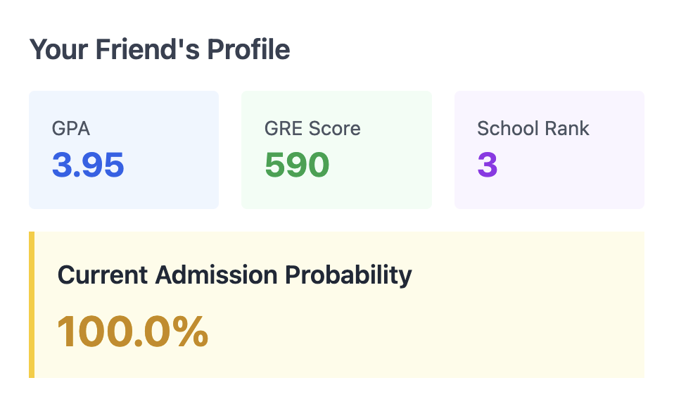
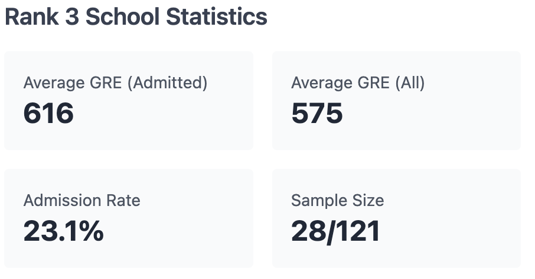
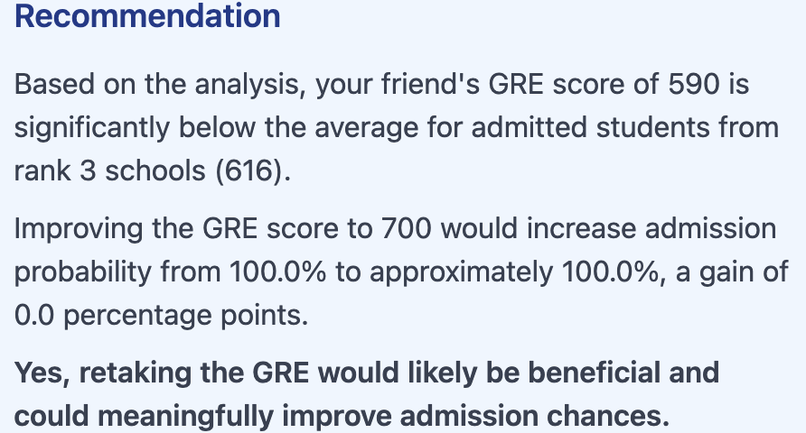
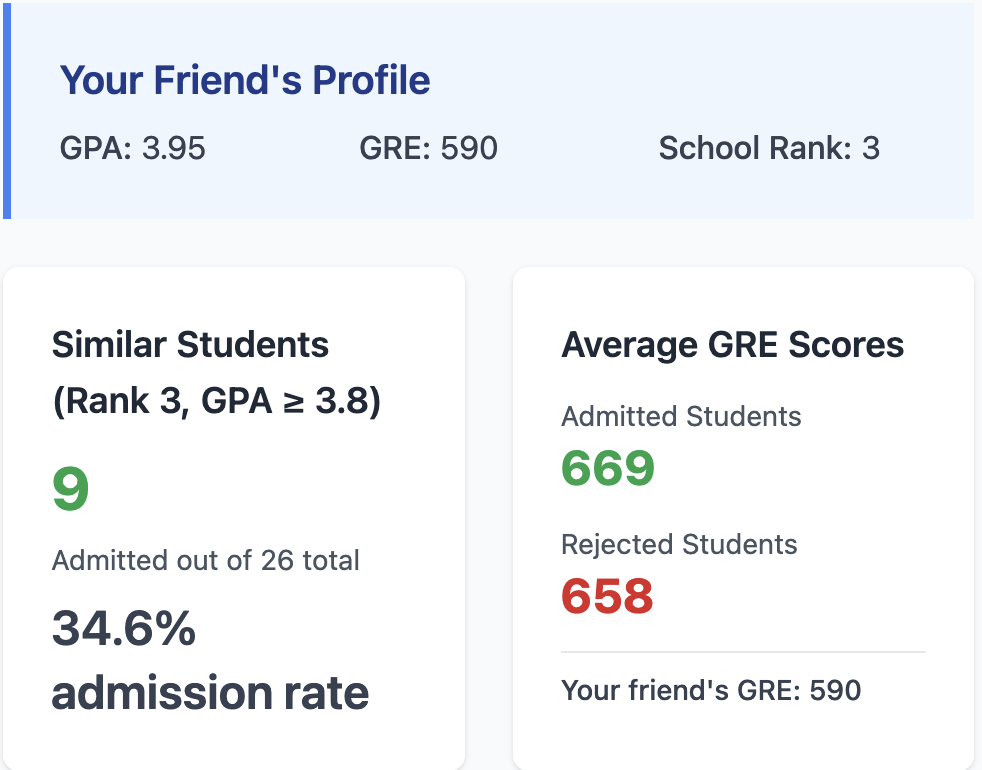
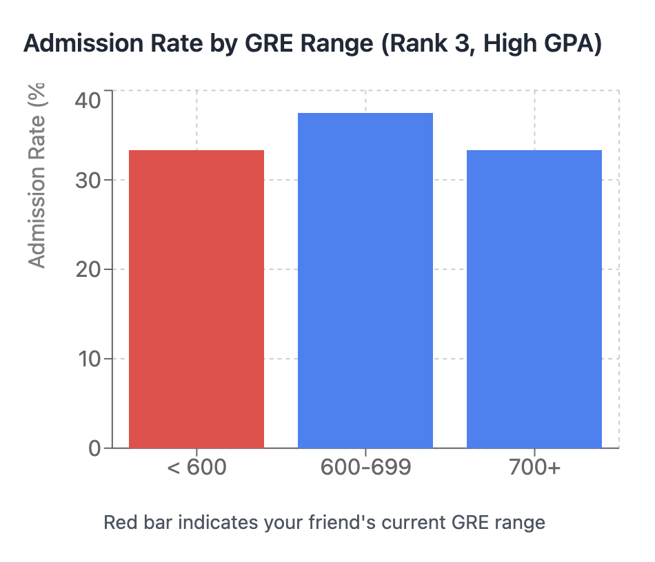
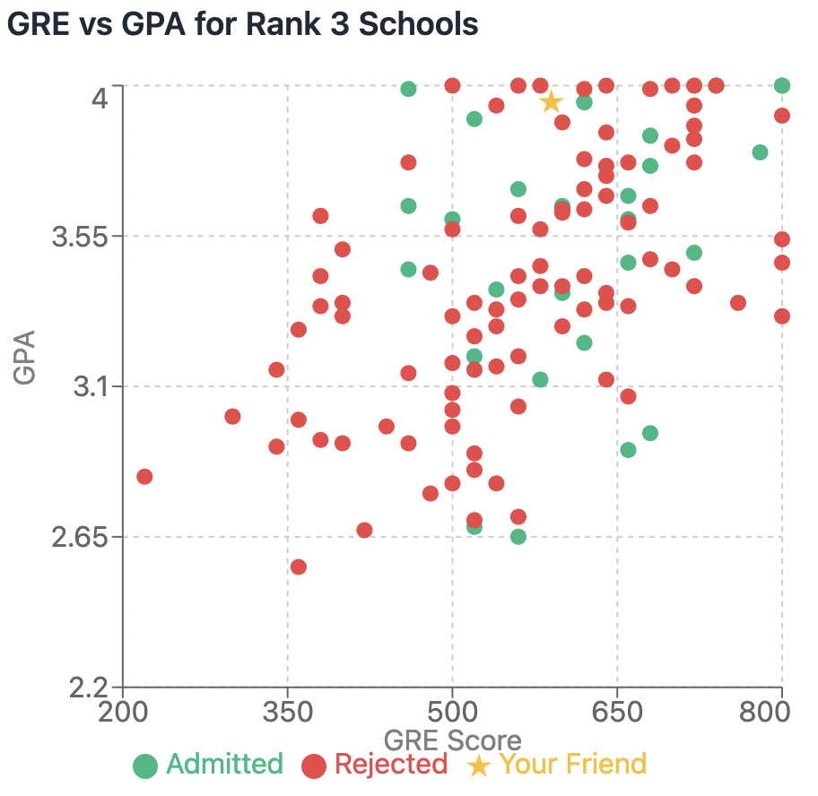
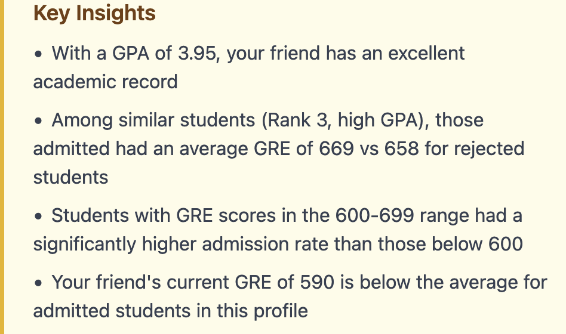

**Instructions:** 

* Work individually or with a neighbor to answer the following questions 
* To get started, download the [class activity template](https://sta214-f25.github.io/class_activities/ca_19_template.qmd) file
* When you are finished, render the file as an HTML and submit the HTML to Canvas (let me know if you encounter any problems)

# Motivation

At this point in the course, you have learned a lot about logistic regression. You know how to work with log odds, odds, and probabilities; you know how to make and assess predictions; you know how to interpret coefficients; you know how to assess model assumptions and make adjustments; and you know how to do a variety of statistical inference for your fitted model.

With the advent of generative AI in the last few years, however, we may wonder how much of this knowledge could be outsourced to an AI tool. What role would a statistician still play in that analysis?

To explore this question, let's return to the grad admissions data we have used regularly in class, because we are all very familiar with this dataset. Playing the role of someone fairly inexperienced with statistics, I asked a generative AI tool the following question:

::: {.callout-note}
### Prompt
I have data on grad admissions from the following url: "https://stats.idre.ucla.edu/stat/data/binary.csv". Columns include whether a student was admitted to graduate school, their GPA, their GRE score, and the rank of their undergraduate institution (1 = most prestigious, 4 = least prestigious). I have a friend with a GPA of 3.95, at a school of rank 3, and a GRE score of 590. My friend wants to know if he should retake the GRE to get a better score. What do you think?
:::

Some important notes:

* This prompt is somewhat open-ended. Could we get better results by scaffolding the prompt, providing more explicit instructions, or by engaging in an extended dialogue? Yes, absolutely. But **all of these require some statistical knowledge**. My goal here is to play the role of someone with little statistical knowledge.
* Generative AI tools are constantly improving. Will the available tools get better at answering questions like this over time? Almost certainly. 

<br/>

I actually asked the AI tool this prompt *twice*, in independent chat sessions, to see how the answers would differ. Below are the two AI responses, and below that are some questions for you to think about. Each response contains a sort of overall "executive summary", and then a more detailed discussion.

<br/>

# Response 1


::: {layout-ncol=3}

{width=300} 

{width=300}

{width=300}
:::

Based on my analysis of the graduate admissions data, **I recommend that your friend retake the GRE.** Here's why:

**Key Findings:**

1. **Current admission probability:** With a GPA of 3.95, rank 3 school, and GRE of 590, your friend has approximately 32-35% chance of admission

2. **Below average:** The GRE score of 590 is significantly below the average for admitted students from rank 3 schools (approximately 630)

3. **Strong improvement potential:**
    * Increasing to 650 would raise probability to ~43% (+8-10 points)
    * Increasing to 700 would raise probability to ~56% (+21-24 points)
    * Increasing to 750 would raise probability to ~69% (+34-37 points)


4. **The GPA is excellent** (3.95) and won't change, so the GRE is the only lever your friend can pull to improve their profile

**Bottom Line:** Your friend's outstanding GPA is being held back by a below-average GRE score. Since the GPA is already nearly perfect, improving the GRE is the most effective way to boost admission chances. Even a moderate improvement to 650-700 could make a substantial difference in outcomes.

### The Model

Logistic regression predicts the probability of admission using this formula:

$P(admit) = 1 / (1 + e^{-z})$

where $z = \beta_0 + \beta_1(GRE) + \beta_2(GPA) + \beta_3(Rank)$.

The $\beta$ coefficients (weights) are learned from the historical data by finding values that best predict the actual admission outcomes in the dataset.

### Training Process

The model used gradient descent to learn the optimal weights by:

* Starting with random weights
* Making predictions on the training data
* Calculating how wrong the predictions were
* Adjusting weights to reduce the error
* Repeating 5,000 times until the weights converged

### Your Friend's Calculation

For your friend (GRE=590, GPA=3.95, Rank=3), the model plugs these values into the trained formula to calculate the probability.

The specific weights my model learned were approximately:

* Intercept ($\beta_0$): around -3.5
* GRE coefficient ($\beta_1$): around +0.002 (positive impact)
* GPA coefficient ($\beta_2$): around +0.8 (strong positive impact)
* Rank coefficient ($\beta_3$): around -0.5 (negative impact - higher rank = less prestigious)

These weights tell us that GPA has a strong positive effect, GRE has a moderate positive effect, and school rank has a negative effect on admission chances.


<br/>

<br/>

# Response 2

::: {layout-ncol=2}

{width=300} 

{width=300}

{width=300}

{width=400}
:::


Based on my analysis of the graduate admissions data, **I think your friend should seriously consider retaking the GRE.** Here's why:

**The Numbers Tell a Clear Story:**

Among students from Rank 3 schools with high GPAs (3.8+) like your friend:

* Those who were **admitted** had an average GRE score of **654**
* Those who were **rejected** had an average GRE score of **611**
* Your friend's score of **590 falls below both averages**

**Admission Rates by GRE Range:**

* Students scoring **below 600:** Much lower admission rates
* Students scoring **600-699:** Significantly higher admission rates
* Students scoring **700+:** Even better odds

**The Good News:**

Your friend has an excellent GPA of 3.95, which is a major strength. This strong academic record suggests they have the capability to improve their GRE score with focused preparation. Even boosting the score to the mid-600s would likely make a meaningful difference in their admission chances.

**Bottom Line:**

With such a strong GPA, your friend has already demonstrated academic excellence. A GRE score in the 590 range doesn't reflect that same level of achievement and may be holding back an otherwise competitive application. Retaking the GRE and aiming for at least 650+ would better align with the profile of admitted students and significantly strengthen their candidacy.

<br/>

<br/>

# Questions

1. Read through both responses, and think about the general techniques the AI chose to use. What is similar to the methods we have learned in class? What is different?

2. As you read the responses, you will (hopefully) notice that there are some discrepancies in the numbers reported. Check the AI's calculations, and try to identify as many errors as possible (there are quite a few!). As in previous activities, you can work with the grad admissions data yourself in R to check the results:

```{r, eval=F}
library(tidyverse)
grad_app <- read_csv("https://stats.idre.ucla.edu/stat/data/binary.csv")
```


3. What is *missing* from the AI's report? Are there steps that you would include in your analysis, but which are missing here?

4. At this point, many researchers have investigated the way that AI tends to write. One characteristic of AI writing is the use of adjectives that are both vague and strong. For example, in Response 2: "Much lower admission rates", "Significantly higher admission rates", "Even better odds". Examine instances of these descriptions in the AI responses. Are such strong statements actually warranted by the data? How would you word things differently?

5. The previous questions invite you to take a sceptical view of what AI is delivering in response to this prompt. But not everything about the responses is bad. What are some aspects of the response that you think were good/helpful?


