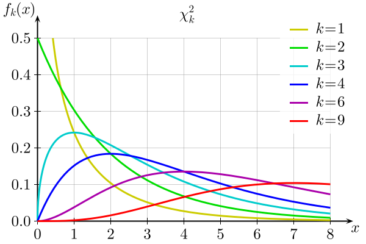

```{r, include=F}
library(tidyverse)
grad_app <- read.csv("https://stats.idre.ucla.edu/stat/data/binary.csv")
```


### Recap: hypothesis testing

.large[
Model:

$$Admit_i \sim Bernoulli(\pi_i)$$

$$\log \left( \dfrac{\pi_i}{1 - \pi_i} \right) = \beta_0 + \beta_1 GPA_i$$

Research question: is there a relationship between GPA and acceptance to a graduate program?

Hypotheses: $H_0: \beta_1 = 0 \hspace{1cm} H_A: \beta_1 \neq 0$
]

---

### Option 1: Wald test (aka z-test)

.large[
```{r}
m1 <- glm(admit ~ gpa, family = binomial, data = grad_app)
summary(m1)$coefficients
```

$z = \dfrac{\widehat{\beta}_1}{SE(\widehat{\beta}_1)} = 3.517$

.question[
Is this an "unusual" $z$-statistic, if $H_0$ is true?
]
]

---

### Option 1: Wald test (aka z-test)

.large[
Approximate null distribution:
]

```{r, echo=F, fig.width=8, fig.height=5}
set.seed(8)
null_statistics <- rnorm(1000)
hist(null_statistics, xlab="z-statistic", 
     main = "Approximate null distribution")
```

---

### Option 1: Wald test (aka z-test)

.large[
Observed test statistic: $z = 3.517$
]

```{r, echo=F, fig.width=8, fig.height=4.5}
x <- seq(-4, 4, 0.1)
y <- dnorm(x)
plot(x, y, type="l", xlab="z", ylab="", lwd=2)
abline(v = c(-3.5, 3.5), col="red", lwd=2)
```

.large[
```{r}
2*pnorm(abs(3.517), lower.tail=F)
```
]

---

### Option 1: Wald test (aka z-test)

.large[
```{r}
2*pnorm(abs(3.517), lower.tail=F)
summary(m1)$coefficients
```
]

---

### Recap: hypothesis testing

.large[
Full model:

$$Admit_i \sim Bernoulli(\pi_i)$$

$$\log \left( \dfrac{\pi_i}{1 - \pi_i} \right) = \beta_0 + \beta_1 GPA_i$$

Wish to test $H_0: \beta_1 = 0$ vs. $H_A: \beta_1 \neq 0$.

.question[
What is my **reduced model** for these hypotheses?
]
]

---

### Recap: hypothesis testing

.large[
Full model:

$$Admit_i \sim Bernoulli(\pi_i)$$

$$\log \left( \dfrac{\pi_i}{1 - \pi_i} \right) = \beta_0 + \beta_1 GPA_i$$

Wish to test $H_0: \beta_1 = 0$ vs. $H_A: \beta_1 \neq 0$.

Reduced model:

$$\log \left( \dfrac{\pi_i}{1 - \pi_i} \right) = \beta_0$$
]

---

### Activity

.large[
Work on the activity (handout), then we will discuss as a class.
]

---

### Activity

.large[
Fitted reduced model:

```{r}
glm(admit ~ 1, family = binomial, data = grad_app)
```

.question[
What do you notice about the "Null" and "Residual" deviance?
]
]

---

### Activity

.large[
```{r}
glm(admit ~ gpa, family = binomial, data = grad_app)
```

.question[
What is the drop-in-deviance statistic for the test $H_0: \beta_1 = 0$ vs. $H_A: \beta_1 \neq 0$?
]
]

---

### Activity

.large[
```{r, echo=F}
glm(admit ~ gpa, family = binomial, data = grad_app)
```

$G = \text{deviance}_{\text{reduced}} - \text{deviance}_{\text{full}} = 13$

.question[
How do we know if this test statistic is "unusual" under the null hypothesis? 
]
]

---

### Activity

.large[
Approximate null distribution:
]

```{r, echo=F, fig.width=8, fig.height=5}
set.seed(8)
null_statistics <- rchisq(1000, df=1)
hist(null_statistics, xlab="Drop-in-deviance (G)", 
     main = "Approximate null distribution")
```

.large[
.question[
Our observed test statistic is $G = 13$. Do you think that the null hypothesis is true?
]
]

---

### Calculating a p-value

```{r, echo=F, fig.width=8, fig.height=5}
set.seed(8)
null_statistics <- rchisq(1000, df=1)
hist(null_statistics, xlab="Drop-in-deviance (G)", 
     main = "Approximate null distribution")
```

.large[
p-value = $P(G > \text{observed value } | H_0 \text{ true})$

Need a distribution to calculate p-value!
]

---

### Class activity

```{r, echo=F, fig.width=8, fig.height=5}
set.seed(8)
null_statistics <- rchisq(1000, df=1)
hist(null_statistics, xlab="Drop-in-deviance (G)", 
     main = "Approximate null distribution")
```

.large[
.question[
Why is the drop-in-deviance always non-negative?
]
]

---

### Class activity

.large[
Under $H_0$, $G \sim \chi^2_k$
]

.center[

]

---

### Class activity

.large[
$H_0: \beta_1 = 0 \hspace{1cm} H_A: \beta_1 \neq 0$
]

.pull-left[
.center[

]
]

.pull-right[
```{r, echo=F, fig.width=6, fig.height=5}
set.seed(8)
null_statistics <- rchisq(1000, df=1)
hist(null_statistics, xlab="Drop-in-deviance (G)", 
     main = "Approximate null distribution")
```
]

.large[
.question[
Under $H_0$, $G \sim \chi^2_k$. Which value of $k$ seems appropriate for the null distribution?
]
]

---

### Class activity

.large[
* Mean of $\chi^2_k$ is $k$
* Variance of $\chi^2_k$ is $2k$

```{r}
mean(null_statistics)
var(null_statistics)
```

]

---

### Calculating a p-value

$H_0: \beta_1 = 0 \hspace{1cm} H_A: \beta_1 \neq 0 \hspace{1cm} G = \text{deviance}_{\text{reduced}} - \text{deviance}_{\text{full}} = 13$

Under $H_0$, $G \sim \chi^2_1$

```{r, echo=F, fig.width=8, fig.height=4.5}
x <- seq(0, 15, 0.1)
y <- dchisq(x, df=1)
plot(x, y, type="l", xlab="G", ylab="", lwd=2)
abline(v = 13, col="red", lwd=2)
```

```{r}
pchisq(13, df=1, lower.tail=F)
```


---

### Drop-in-deviance test (aka likelihood ratio test)

.large[
**Goal:** Compare nested models (full and reduced models)

Steps:

* Calculate deviance for full and reduced models
* Test statistic: $G = \text{deviance}_{\text{reduced}} - \text{deviance}_{\text{full}}$
* Null distribution: under $H_0$, $G \sim \chi^2_q$
]

---

### Wald test vs. drop-in-deviance test

.pull-left[
**Wald test** (z-test)

* like t-tests
* test a *single* parameter
* some example hypotheses:
    * $H_0: \beta_1 = 0$ vs. $H_A: \beta_1 \neq 0$
    * $H_0: \beta_1 = 0$ vs. $H_A: \beta_1 > 0$
* null distribution: $N(0, 1)$
]

.pull-right[
**Drop-in-deviance test** (likelihood ratio test)

* like nested F-tests
* test one or more parameters
* some example hypotheses:
    * $H_0: \beta_1 = 0$ vs. $H_A: \beta_1 \neq 0$
    * $H_0: \beta_1 = \beta_2 = 0$ vs $H_A$: at least one of $\beta_1, \beta_2 \neq 0$
* null distribution: $\chi^2_q$
]

---

### Activity

.large[
Work on the activity (handout), then we will discuss as a class.
]

---

### Activity

$$Admit_i \sim Bernoulli(\pi_i)$$

$$\log \left( \dfrac{\pi_i}{1 - \pi_i} \right) = \beta_0 + \beta_1 GPA_i + \beta_2 GRE_i + \beta_3 Rank2_i + \beta_4 Rank3_i + \beta_5 Rank4_i$$

.large[
.question[
We want to test whether there is a relationship between Rank and grad school acceptance, after accounting for GPA and GRE. What are my null and alternative hypotheses?
]
]

---

### Activity

$$Admit_i \sim Bernoulli(\pi_i)$$

$$\log \left( \dfrac{\pi_i}{1 - \pi_i} \right) = \beta_0 + \beta_1 GPA_i + \beta_2 GRE_i + \beta_3 Rank2_i + \beta_4 Rank3_i + \beta_5 Rank4_i$$

.large[
$H_0: \beta_3 = \beta_4 = \beta_5 = 0$

$H_A:$ at least one of $\beta_3, \beta_4, \beta_5 \neq 0$
]

.large[
.question[
What is the reduced model?
]
]

---

### Activity

```{r, echo=F}
grad_app <- read.csv("https://stats.idre.ucla.edu/stat/data/binary.csv")
glm(admit ~ gpa + gre + factor(rank), family = binomial, data = grad_app)
glm(admit ~ gpa + gre, family = binomial, data = grad_app)
```

---

### Activity

.large[
$H_0: \beta_3 = \beta_4 = \beta_5 = 0$

$H_A:$ at least one of $\beta_3, \beta_4, \beta_5 \neq 0$

Drop-in-deviance test: $G = 21.8$

.question[
What is the distribution of $G$ under the null hypothesis?
]
]

---

### Activity

.large[
$H_0: \beta_3 = \beta_4 = \beta_5 = 0$

$H_A:$ at least one of $\beta_3, \beta_4, \beta_5 \neq 0$

Drop-in-deviance test: $G = 21.8$

Under $H_0$, $G \sim \chi^2_3$

```{r}
pchisq(21.8, df=3, lower.tail=F)
```

]

